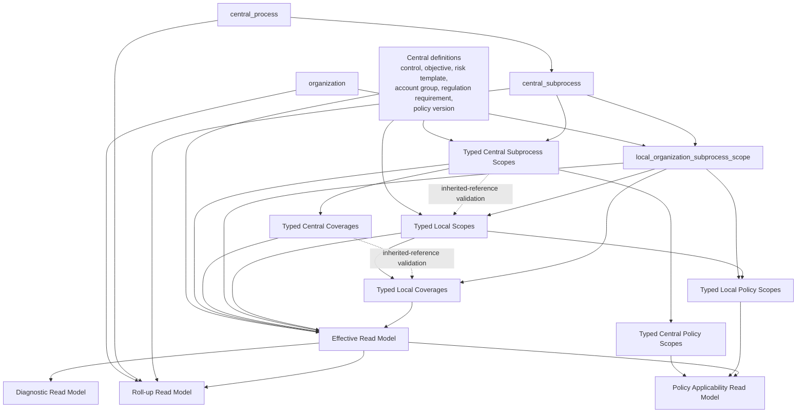
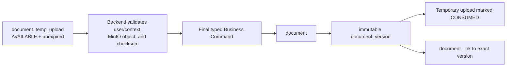

# Master Data V2 Dependency Map

## Purpose and authority

This map sequences the approved 45-business-table model and the one `document_temp_upload` technical table for 46 physical tables total across Flyway, Backend, UI, revision processing, document handling, and read models.

Entity names and arrows follow the Final Logical Model §5–§14.

Authoritative source files: `GRC_Master_Data_Reference_Conceptual_Model_FA.docx`, `GRC_Master_Data_Logical_Model_Final_FA.docx`, and `GRC_Master_Data_Physical_Design_Reference_FA.docx`.

Oracle/Flyway and MinIO decisions follow the Physical Design Reference §8–§18.

The map is a delivery dependency map; it does not add any table, cache, outbox, job, scheduler, workflow, or materialized result.

## Dependency principles

- Central definitions exist independently from Organization.
- Central Process and Central Subprocess are separate; only Subprocess participates in Scope/Coverage.
- Central Scope exists before Central Coverage or exact Central Policy Scope.
- A Local Organization–Subprocess Scope exists before every Local Scope, Coverage, or Local Policy Scope.
- Local Scope exists before Local Coverage and exact Local Control/Requirement Policy Scope.
- A Central reference is validated before an inherited Local Scope or Coverage can be applied.
- Document Version is created from a consumed Temporary Upload before a Document Link is created.
- A Business Revision header exists before Backend-created Revision Content is persisted and applied.
- Read models depend on source tables and never become source-table dependencies.
- Central changes can affect read results and impact analysis; they never create physical Local mutations.

## Central-to-Local dependency direction

The solid arrows identify stored foreign-key or explicit application dependencies.

The dotted arrows identify inherited-reference validation and Effective dependency, not automatic data synchronization.

`organization` is shown alongside Central definitions because it is structural reference data and the Local anchor, not because Central definitions become organization-owned.

## Table creation dependency by family

### A. Structural and Central Definitions

| Creation wave | Tables | Must exist first | Why |
| --- | --- | --- | --- |
| A1 | `organization` | Oracle common conventions | Organization parent-tree FK is self-contained. |
| A2 | `central_process` | Oracle common conventions | Process parent-tree FK is self-contained. |
| A3 | `central_subprocess` | `central_process` | Every Scope/Coverage context depends on an exact Subprocess leaf. |
| A4 | `central_control`, `central_control_objective` | Oracle common conventions | Independent Central definitions. |
| A5 | `central_risk_category` | Oracle common conventions | Risk-category tree parent FK. |
| A6 | `central_risk_template` | `central_risk_category` | Template has a required category parent. |
| A7 | `central_account_group` | Oracle common conventions | Account-group parent-tree FK. |
| A8 | `central_regulation_group` | Oracle common conventions | Regulation-group tree parent FK. |
| A9 | `central_regulation` | `central_regulation_group` | Regulation belongs to a group. |
| A10 | `central_regulation_requirement` | `central_regulation` | Requirement is the atomic compliance child. |
| A11 | `central_policy_group` | Oracle common conventions | Policy-group parent-tree FK. |
| A12 | `central_policy` | `central_policy_group` | Policy belongs to a group. |
| A13 | `central_policy_version` | `central_policy` | Policy Version belongs to its stable Policy identity. |

### B. Central Scope, Classification, Policy Scope, and Coverage

| Creation wave | Tables | Direct prerequisites | Dependency reason |
| --- | --- | --- | --- |
| B1 | `central_subprocess_control_scope` | Subprocess + Control | Establishes Control contextual membership. |
| B2 | `central_subprocess_risk_scope` | Subprocess + Risk Template | Establishes Risk contextual membership. |
| B3 | `central_subprocess_control_objective_scope` | Subprocess + Control Objective | Establishes Objective contextual membership. |
| B4 | `central_subprocess_requirement_scope` | Subprocess + Regulation Requirement | Establishes Requirement contextual membership. |
| B5 | `central_control_account_group` | Control + Account Group | Direct classification relation. |
| B6 | `central_control_objective_account_group` | Control Objective + Account Group | Direct classification relation. |
| B7 | `central_policy_version_subprocess_scope` | Policy Version + Subprocess | Baseline policy inclusion. |
| B8 | `central_policy_version_control_scope` | Policy Version + Central Control Scope | Exact-context policy decision. |
| B9 | `central_policy_version_requirement_scope` | Policy Version + Central Requirement Scope | Exact-context policy decision. |
| B10 | `central_subprocess_risk_control_coverage` | Central Risk Scope + Central Control Scope | Requires same-subprocess composite FKs. |
| B11 | `central_subprocess_risk_control_objective_coverage` | Central Risk Scope + Central Control Objective Scope | Requires same-subprocess composite FKs. |
| B12 | `central_subprocess_control_control_objective_coverage` | Central Control Scope + Central Control Objective Scope | Requires same-subprocess composite FKs. |
| B13 | `central_subprocess_requirement_control_coverage` | Central Requirement Scope + Central Control Scope | Requires same-subprocess composite FKs. |

### C. Local Context, Scope, Coverage, and Policy Scope

| Creation wave | Tables | Direct prerequisites | Dependency reason |
| --- | --- | --- | --- |
| C1 | `local_organization_subprocess_scope` | Organization + Central Subprocess | Required parent Context for every Local relation. |
| C2 | `local_subprocess_control_scope` | Local Context + Control; optional Central Control Scope | Typed Local Control Scope and local execution fields. |
| C3 | `local_subprocess_risk_scope` | Local Context + Risk Template; optional Central Risk Scope | Typed Local Risk Scope. |
| C4 | `local_subprocess_control_objective_scope` | Local Context + Control Objective; optional Central Objective Scope | Typed Local Objective Scope. |
| C5 | `local_subprocess_requirement_scope` | Local Context + Requirement; optional Central Requirement Scope | Typed Local Requirement Scope. |
| C6 | `local_subprocess_risk_control_coverage` | Parent Context + Local Risk Scope + Local Control Scope; optional Central Coverage | Same-context Local Coverage. |
| C7 | `local_subprocess_risk_control_objective_coverage` | Parent Context + Local Risk Scope + Local Objective Scope; optional Central Coverage | Same-context Local Coverage. |
| C8 | `local_subprocess_control_control_objective_coverage` | Parent Context + Local Control Scope + Local Objective Scope; optional Central Coverage | Same-context Local Coverage. |
| C9 | `local_subprocess_requirement_control_coverage` | Parent Context + Local Requirement Scope + Local Control Scope; optional Central Coverage | Same-context Local Coverage. |
| C10 | `local_policy_organization_scope` | Organization + Policy Version | Organization applicability/propagation decision. |
| C11 | `local_policy_subprocess_scope` | Local Context + Policy Version | Subprocess-level local policy decision. |
| C12 | `local_policy_control_scope` | Local Control Scope + Policy Version | Exact Control policy decision. |
| C13 | `local_policy_requirement_scope` | Local Requirement Scope + Policy Version | Exact Requirement policy decision. |

### D. Document and Revision

| Creation wave | Tables | Direct prerequisites | Dependency reason |
| --- | --- | --- | --- |
| D1 | `document` | Oracle conventions | Stable document identity. |
| D2 | `document_version` | Document | Immutable finalized version metadata and object key. |
| D3 | `document_link` | Document Version + controlled target vocabulary | Link references a precise version. |
| T1 | `document_temp_upload` | Document Version FK target may be nullable | Technical staging metadata; it can exist before final version. |
| R1 | `masterdata_revision` | Organization for Local domain; self parent optional | Revision header before contents. |
| R2 | `masterdata_revision_content` | Master Data Revision | Ordered controlled mutation records. |

## Scope-before-Coverage rule

No Coverage command may create an endpoint Scope implicitly.

No Coverage command may use a raw Central definition ID in place of a Scope ID.

No Central Coverage command may cross a Subprocess boundary.

No Local Coverage command may cross a Local Organization–Subprocess Context boundary.

No Local Coverage command stores a redundant `subprocess_id`.

No direct Control–Regulation command exists.

A Requirement–Control Coverage command needs a Requirement Scope and a Control Scope first.

The direct Control–Control Objective Coverage command is separate from Risk–Control Objective Coverage.

No API derives one Coverage from another.

## Required Flyway Day-Zero ordering

The Physical Design Reference §16-1 provides the migration sequence.

1. Create Oracle conventions, common checks, and helper constraints.
2. Create `organization`, `central_process`, and `central_subprocess`.
3. Create the remaining Central definitions and `central_policy_version`.
4. Create Central Scope, Classification, Central Policy Scope, and Central Coverage tables.
5. Create Local Context, Local Scope, Local Coverage, and Local Policy Scope tables.
6. Create `document`, `document_version`, and `document_link`.
7. Create `document_temp_upload`.
8. Create `masterdata_revision` and `masterdata_revision_content`.
9. Add supplementary unique constraints, composite foreign keys, checks, and indexes.
10. Create read-only Effective, Diagnostic, Roll-up, and Policy Applicability views or query-facing database objects.

The sequence is Day-Zero creation on a fresh Oracle schema.

It is not a chain of Legacy `DROP`, `ALTER`, data-copy, or compatibility migrations.

## Backend implementation ordering

| Backend slice | Implement after | Deliverable | Key dependency check |
| --- | --- | --- | --- |
| 1. Shared foundation | Flyway conventions | UUID RAW mapping, lifecycle/validity, status enums, optimistic locking, revision guard | Hibernate validates rather than creates DDL. |
| 2. Structural trees | Shared foundation | Organization, Process, Subprocess command/query services | Cycle validation before revision apply. |
| 3. Central catalogs | Structural trees | Control, Control Objective, Risk Category/Template, Account Group, Regulation hierarchy, Policy/Version | Separate formerly combined concepts. |
| 4. Central relations | Central catalogs | Typed scopes, classifications, policy scopes, coverage commands | Same-subprocess composite FKs and typed validation. |
| 5. Local context | Central relations | Local Context and typed Local Scope commands | Local inherited range and definition/context validation. |
| 6. Local relations | Local context | Local Coverage and Local Policy Scope commands | Same-context composite FKs and precedence input. |
| 7. Document + Revision | Shared foundation and targets | Temporary upload, document/version/link, revision command coordination | One-time upload consume and immutable version. |
| 8. Read queries | Central/local/document sources | Effective, Diagnostic, Roll-up, Policy Applicability query services | No mutable endpoint or materialization. |
| 9. Legacy removal | Each owning slice | Remove old endpoints/entities/services/permissions | No compatibility API or dual write remains. |

The Revision command service is a cross-slice dependency but not a generic persistence shortcut.

It determines revision domain, creates the header/content, validates, performs required impact analysis, applies all mutations in one transaction, and returns the mutation result.

## Revision dependencies

```mermaid
flowchart LR
    Cmd[Typed Business Command]
    Auth[Permission and resource authorization]
    Val[Domain and cross-table validation]
    IA[Impact analysis when required]
    Rev[masterdata_revision]
    Contents[masterdata_revision_content]
    Tx[Single Backend transaction]
    Apply[Typed source-table mutations]
    Result[entityId + revisionId + version]

    Cmd --> Auth --> Val
    Val --> IA
    IA --> Rev
    Rev --> Contents
    Contents --> Tx
    Tx --> Apply
    Apply --> Result
```

Central commands create only `CENTRAL` revisions.

Local commands create only `LOCAL` revisions tied to one Organization.

Command handlers must reject cross-domain content before persistence.

A Central impact can identify Local remediation work but cannot create it automatically.

Document Link to the current DRAFT revision is handled as metadata of that revision and does not start a recursive revision.

## Document dependencies

The technical temporary-upload flow remains separate and precedes final Document creation at runtime: `document_temp_upload -> final Business Command -> document/document_version/document_link`.

The user-facing temporary-upload flow must never perform a direct permanent final upload.

The final object key is Backend-owned.

There is no distributed Oracle–MinIO transaction.

The Backend uses ordered operations and best-effort cleanup.

Temporary MinIO cleanup uses bucket lifecycle behavior rather than a job or scheduler table.

## Read-model dependencies

| Read model | Source dependencies | Output boundary |
| --- | --- | --- |
| Effective | Central definitions, Central Scope/Coverage, Local Context/Scope/Coverage, stored status, validity, one evaluation date | One primary effective status and source; read-only. |
| Diagnostic | Effective dependencies plus all blocker branches and validation/impact facts | Multiple simultaneous blocker rows; read-only and permission-bound. |
| Roll-up | Organization hierarchy, Process hierarchy, Subprocess source records, Effective results | Child-to-parent visibility and counts while preserving source IDs; read-only. |
| Policy Applicability | Policy Version, Central Policy Scope, Local Policy Scope, Organization hierarchy, Local Context, one evaluation date | Highest-priority applicable decision or `NOT_APPLICABLE`; read-only. |

No source-table command depends on a computed read result being materialized.

No read model emits a Business Revision merely because a calculation changes.

## UI implementation ordering

1. Preserve the Master Data hub, UI5, FCL, List Report, Object Page, tree, search, selection, expanded-state, RTL, and i18n building blocks.
2. Rewire Organization and Process/Subprocess tree data to the separate approved structural tables.
3. Replace generic catalog forms with Central Control Objective, Risk Category/Template, Regulation hierarchy, Policy/Version, and Account Group forms.
4. Add Central Scope, Classification, Central Policy Scope, and Central Coverage screens/dialogs after the central relation APIs exist.
5. Add Local Organization–Subprocess Context before Local Scope, Local Coverage, and Local Policy Scope workflows.
6. Replace generic document attachment UI with temporary upload, immutable versions, exact links, and secure download presentation.
7. Add revision-aware mutation feedback containing entity/revision/version information.
8. Add read-only Effective, Diagnostic, Roll-up, and Policy Applicability views after query APIs exist.
9. Remove the Legacy tab, route, API repository, state, permission, and i18n element in the same vertical slice that replaces it.

## Vertical-slice ownership

| Later vertical slice | Owns approved feature | Owns Legacy cleanup |
| --- | --- | --- |
| Foundation | Oracle conventions, UUID/RAW mapping, lifecycle, revision framework | V2-incompatible master-data migration assumptions and UUID-VARCHAR mapping. |
| Organization and process tree | `organization`, `central_process`, `central_subprocess` | Combined process/subprocess persistence and organization-process assignment flow. |
| Central catalog | Central definitions and Policy Version | Combined risk, regulation, policy, generic objective, and account-group JSON structures. |
| Central relation | Central Scope, Classification, Policy Scope, Coverage | Generic process/reference/control relationship tables and direct Control–Regulation links. |
| Local relation | Local Context, Local Scope/Coverage/Policy Scope | Generic organization-reference and organization-process-risk relationships. |
| Document and revision | Document/version/link, temporary upload, revisions | Generic attachment, direct final upload, session-based upload/commit, legacy document tables. |
| Read model | Effective, Diagnostic, Roll-up, Policy Applicability | Any mutable or cached substitute for derived outcomes. |
| UI and integration | Compatible visual workflows and resource authorization | Dead routes, stores, API repos, permissions, i18n keys, DTOs, controllers, and services. |

## Completion rule

Do not begin a dependent feature by inventing a temporary generic relation.

Do not reorder Local Coverage ahead of Local Scope.

Do not reorder Document Link ahead of Document Version.

Do not expose read-model data through mutable CRUD.

Do not leave the Legacy implementation to a final catch-all cleanup phase.

Every slice must demonstrate its source dependencies, typed constraints, Backend-owned revision path, and removal of the behavior it supersedes.
