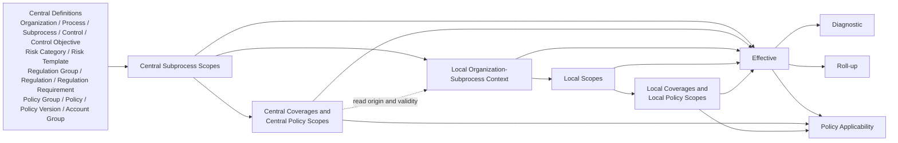
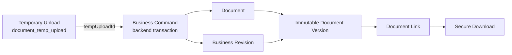

# Master Data V2 Dependency Map

## 1. Purpose

This map establishes the mandatory dependency direction for Master Data V2.

It covers table creation, Flyway Day-Zero ordering, backend vertical slices, UI delivery, revision creation, document handling, and read-only results.

It is read together with [implementation-contract.md](implementation-contract.md) and [table-catalog.md](table-catalog.md).

The direction prevents legacy assignment tables from reappearing as shortcut dependencies.

## 2. Non-negotiable direction rules

Central definitions are created before any Central Blueprint member.

Central Subprocess Scope is created before any typed Central Scope row.

Typed Central Scope is created before Central Classification, Central Coverage, and Central Policy Scope.

Central Coverage never crosses the enclosing Central Subprocess Scope.

Organization and Subprocess are created before a Local Organization–Subprocess Context.

Local Context is created before every Local Scope, Local Coverage, and Local Policy Scope row.

Local Scope is created before Local Classification or Local Coverage.

Local Coverage never crosses the enclosing Local Context.

Local validity is checked against the referenced Central origin before the Local command commits.

Central changes never write Local database rows as a side effect.

Business Revision is written by the backend in the same database transaction as a successful Business Command.

Temporary upload happens before a document-owning command.

Temporary upload consumption happens only inside the document-owning Business Command.

Document Version is created only after its Document identity exists in the transaction.

Document Link is created only after its immutable Document Version exists.

Effective, Diagnostic, Roll-up, and Policy Applicability are terminal read models, not persistence dependencies.

## 3. Central-to-Local dependency graph

The solid arrows describe persistence or command prerequisites.

The dashed arrow describes read/validation provenance only.

The arrows toward Effective and the other read results do not create tables or write data.

## 4. Central Definition dependencies

`organization` has only its optional organization-parent dependency.

`process` can reference a parent Process.

`subprocess` depends on Process.

Control, Control Objective, and Account Group definitions are Central and independent from Organization.

Risk Template depends on Risk Category.

Regulation depends on Regulation Group.

Regulation Requirement depends on Regulation.

Policy depends on Policy Group.

Policy Version depends on Policy.

Account Group assertion, account range, Control Objective, and Risk Template relations depend on Account Group and their typed target definition.

No definition depends on a Central Scope, Local Context, Document Link, or Effective result.

No definition contains a legacy `node_type` discriminator that combines entities.

## 5. Central Scope dependency order

`central_subprocess_scope` depends on Subprocess.

`central_scope_control` depends on Central Subprocess Scope and Control.

`central_scope_control_objective` depends on Central Subprocess Scope and Control Objective.

`central_scope_risk_template` depends on Central Subprocess Scope and Risk Template.

`central_scope_regulation_requirement` depends on Central Subprocess Scope and Regulation Requirement.

`central_scope_account_group` depends on Central Subprocess Scope and Account Group.

`central_policy_scope` depends on Central Subprocess Scope and immutable Policy Version.

These relations are typed by their table names and no target-type discriminator substitutes for them.

## 6. Central Classification and Coverage dependency order

`central_control_classification` depends on a Control Scope member and a Control Objective Scope member in the same Central Subprocess Scope.

`central_control_objective_risk_coverage` depends on Control Objective Scope and Risk Template Scope in the same Central Subprocess Scope.

`central_control_risk_coverage` depends on Control Scope and Risk Template Scope in the same Central Subprocess Scope.

`central_requirement_control_coverage` depends on Requirement Scope and Control Scope in the same Central Subprocess Scope.

`central_control_account_group_coverage` depends on Control Scope and Account Group Scope in the same Central Subprocess Scope.

Composite foreign keys are the physical dependency that prevents one coverage from mixing Subprocesses.

Coverage validity may not exceed the validity intersection of its source and target Scope members.

No Central Coverage links Control directly to Regulation.

No Central Coverage creates a risk score, assessment result, test result, or performance plan.

## 7. Local Context dependency order

`local_organization_subprocess_context` depends on Organization, Subprocess, and the matching Central Subprocess Scope.

The composite key to Central Subprocess Scope proves that the context's Subprocess matches the blueprint's Subprocess.

The Context is the only Local aggregate root.

An Organization alone is insufficient for Local Scope creation.

A Process alone is insufficient for Local Scope creation.

A generic organization reference assignment is never a prerequisite or a fallback.

One Local Context must be explicitly created by a business command before any local facts appear.

## 8. Local Scope dependency order

Each Local Scope row depends on one Local Context.

Each Local Scope row depends on the corresponding typed Central Scope origin.

Local Control Scope depends on Central Control Scope.

Local Control Objective Scope depends on Central Control Objective Scope.

Local Risk Template Scope depends on Central Risk Template Scope.

Local Regulation Requirement Scope depends on Central Requirement Scope.

Local Account Group Scope depends on Central Account Group Scope.

Local Policy Scope depends on Central Policy Scope.

The origin relation is not synchronization.

The origin relation enables traceability and local-validity containment checks.

Local commands store their own Business Revision rather than reusing the Central revision.

## 9. Local Classification and Coverage dependency order

`local_control_classification` depends on Local Control Scope and Local Control Objective Scope from the same Local Context.

`local_control_objective_risk_coverage` depends on Local Control Objective Scope and Local Risk Template Scope from the same Local Context.

`local_control_risk_coverage` depends on Local Control Scope and Local Risk Template Scope from the same Local Context.

`local_requirement_control_coverage` depends on Local Requirement Scope and Local Control Scope from the same Local Context.

`local_control_account_group_coverage` depends on Local Control Scope and Local Account Group Scope from the same Local Context.

Local coverage commands validate Local member status and validity.

Local coverage commands validate Central-origin validity where the selected Local members have origins.

Local coverage commands return the owning Local entity id, the new Business Revision id, and the new optimistic-lock version.

No Local Coverage command is allowed to emit a generic `relationType` or `targetId` payload.

## 10. Document and revision graph

The temporary upload is created before the Business Command but is not itself a Business Revision.

The command validates uploader, state, expiry, file metadata, and permitted consuming use case.

The command atomically marks the upload consumed in Oracle and creates or associates Document facts in its transaction.

The physical MinIO operation is not an Oracle distributed transaction.

The command therefore uses explicit recoverable state and idempotency handling when a storage action fails.

Document Version creation needs a Document identity and a Business Revision identity.

Document Link needs an immutable Document Version and an authorized, allow-listed target aggregate.

Secure download resolves authorization from the document link and version before any storage URL or stream is issued.

## 11. Revision dependencies

Business Revision is a foundation dependency for all mutable vertical slices.

Each successful create command creates a Business Revision before the transaction commits.

Each successful update, status change, delete, restore, classification change, scope change, coverage change, policy-scope change, and document command creates a Business Revision.

Revision Content depends on the Business Revision root record.

Revision Content serializes only backend-owned before/after snapshots.

Revision Content target types are closed to approved Master Data aggregates.

A read query never creates a Business Revision.

A failed validation never creates an applied Business Revision.

An idempotent retry with the same command identity returns the prior mutation result without creating a duplicate revision.

## 12. Read-model dependencies

Effective reads depend on evaluation date, lifecycle, validity, Central Scope, Central Coverage, Local Context, Local Scope, Local Coverage, Central Policy Scope, and Local Policy Scope.

Effective reads may include Document Link and Document Version availability where a result needs document evidence status.

Diagnostic reads depend on the Effective resolution trace and expose why a Central or Local item was included, overridden, invalid, absent, or excluded.

Roll-up reads depend on Effective output and the tree hierarchy needed for the requested aggregation boundary.

Policy Applicability depends on Effective context plus Central and Local Policy Scope and the validity/lifecycle of the selected Policy Version.

Read-model APIs accept one common `evaluationDate`.

Read-model APIs are read-only and cannot trigger local materialization.

Read-model APIs are paginated and sortable when output is a collection.

No query writes cache rows, result rows, or status markers into Master Data tables.

## 13. Flyway Day-Zero ordering

The new schema is installed only on a fresh database.

The V2 Flyway set begins with common `RAW(16)`, timestamp, lifecycle, version, and constraint conventions.

The first logical migration layer creates the 18 Structural and Central Definition tables.

The second logical migration layer creates `central_subprocess_scope` and its typed Central Scope member tables.

The third logical migration layer creates Central Policy Scope, Classification, and Coverage tables after their member tables.

The fourth logical migration layer creates Local Context before Local Scope tables.

The fifth logical migration layer creates Local Classification, Local Coverage, and Local Policy Scope after local member tables.

The sixth logical migration layer creates Business Revision before Document Version's revision foreign key.

The seventh logical migration layer creates Document, Document Version, Document Link, and the one technical temporary-upload table.

The last logical migration layer creates required indexes, composite foreign keys, and check constraints not declared inline.

Permission seed data may be placed after V2 API resource vocabulary is finalized, but it is not a Master Data business table.

No V2 migration reads, copies, drops, alters, or transforms legacy Master Data rows.

No legacy `V1003` through `V1161` object is part of the V2 Day-Zero dependency graph.

## 14. Backend implementation ordering

**Slice 0 — Day-Zero foundation** owns RAW UUID mapping, Flyway configuration for a fresh installation, explicit lifecycle base, optimistic locking, error envelope, Business Revision core, and permission-boundary scaffolding.

**Slice 1 — Central definitions** owns Organization, separate Process/Subprocess, Control Objective, Control, split Risk hierarchy, split Regulation hierarchy, split Policy/Policy Version, and normalized Account Group definition relations.

**Slice 2 — Central Scope** owns Central Subprocess Scope and the five typed Central Scope membership commands and reads.

**Slice 3 — Central Classification, Coverage, and Policy Scope** owns same-Subprocess validation, Requirement–Control Coverage, central policy applicability facts, and removal of direct Process/Control legacy assignments.

**Slice 4 — Local Context** owns Organization–Subprocess Context creation, validation, lifecycle, and removal of legacy organization-process assignment flows.

**Slice 5 — Local Scope, Classification, Coverage, and Policy Scope** owns local origin/validity checks, same-context validation, and removal of generic organization reference/risk flows.

**Slice 6 — Document and revision integration** owns temporary upload, Document, immutable Document Version, Document Link, secure download, and removal of generic attachment/control-document flows.

**Slice 7 — Read models** owns Effective, Diagnostic, Roll-up, and Policy Applicability query services and their authorization.

**Slice 8 — Cleanup and hardening** owns deletion of dead legacy controllers, DTOs, mappers, services, repositories, entities, permissions, routes, and translations introduced by completed slices.

## 15. UI implementation ordering

The UI first adopts shared mutation-result handling for `entityId`, `revisionId`, and `version`.

The UI then replaces Central definition data flows while retaining compatible FCL, List Report, Object Page, tree, search, selection, expanded-state, RTL, UI5, and i18n patterns.

The Process/Subprocess visual tree is delivered as a read projection over separate backend entities.

The UI next adds Central Scope and typed Central Coverage pages, filtered value help, and policy scope tabs.

The UI then adds Local Context as the entry point for all local selectors and lists.

Local Scope, Local Coverage, and Local Policy Scope pages are delivered only after Local Context exists.

The document UI switches to backend-issued `tempUploadId` before any V2 document-owning page is released.

Document Version history and secure download are delivered with the document slice.

Effective, Diagnostic, Roll-up, and Policy Applicability are delivered as read-only query pages with a shared evaluation-date control.

Each UI slice removes the legacy repository, store, component, route, and i18n keys that it replaces.

## 16. Feature ownership matrix

| Later vertical slice | Owns | Must not depend on |
| --- | --- | --- |
| Day-Zero foundation | RAW UUIDs, revision root/content, lifecycle, version, error and permission conventions | Legacy UUID text compatibility |
| Central definitions | All B01–B18 definition aggregates | Local Context or generic assignments |
| Central Scope | B19–B24 typed members | Coverage before Scope |
| Central Coverage and Policy Scope | B25–B30 | Direct Control–Regulation or generic relation APIs |
| Local Context | B31 | Organization-process assignment compatibility |
| Local Scope and Coverage | B32–B42 | Cross-context coverage or automatic central mutation |
| Document and revision integration | B43–B47 and T01 | Direct final upload or `tempSessionId` |
| Read models | Effective, Diagnostic, Roll-up, Policy Applicability queries | Materialized derived tables |
| Cleanup | Legacy code owned by prior slices | A final catch-all deletion phase |

## 17. Failure and rollback dependencies

Optimistic-lock conflict is detected before mutation and creates no new revision.

Business-key duplicate is detected by database uniqueness and mapped to a stable conflict error.

Hierarchy cycle is detected before hierarchy mutation and creates no new revision.

Central or Local validity violation is detected before scope or coverage mutation and creates no new revision.

Cross-Subprocess Central Coverage is rejected by composite foreign keys and command validation.

Cross-context Local Coverage is rejected by composite foreign keys and command validation.

Invalid, expired, or consumed temporary upload is rejected before Document Version creation.

Failed MinIO finalization invokes the documented compensating state without pretending an Oracle–MinIO distributed transaction exists.

Retry safety is anchored in command identity and stored Business Revision result, never in frontend transaction ordering.
